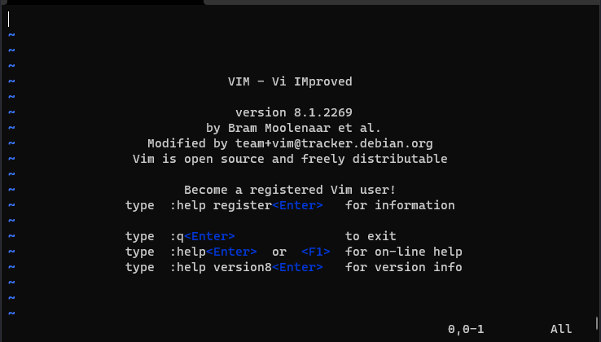
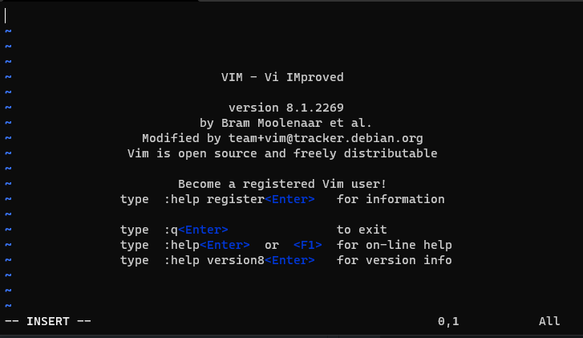
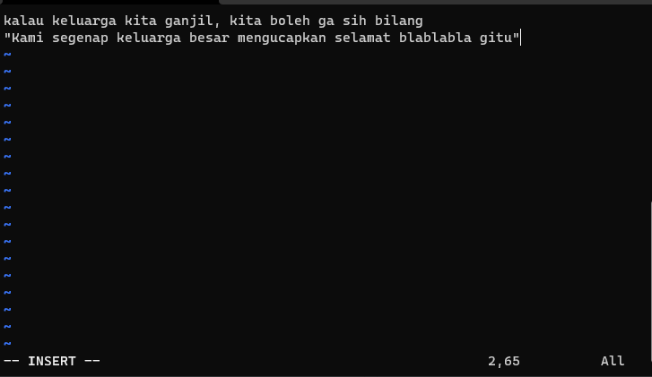
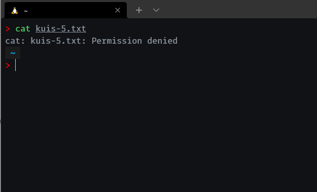

- [ ] FIle Permission
- [ ] Umask

# Sistem Operasi Pertemuan 5

## Overview

Pada pertemuan ini kita akan sama-sama belajar tentang text editor di terminal linux, dimana kita akan belajar menggunakan VIM untuk urusan editing text. kemudian kita akan belajar tentang File Permission di linux, dan bagaimana cara mengubah izin akses nya menggunakan perintah chmod. Dan terakhir kita akan belajar umask. 

## VIM

### Pengenalan Vim

Vim merupakan singkatan dari Vi iMproved yang dirilis pertama kali tahun 1991. Vim merupakan tiruan editor yang sudah ada bernama vi dengan menambah beragam fitur baru (perhatikan lagi kepanjangan dari vim). Vi sendiri sudah ada sejak tahun 1972.

dia bisa dipakai untuk ngoding di terminal. Kelebihan ini tentu sangat berguna bagi developer yang sering bekerja dengan sistem remote yang bisanya terhubung lewat SSH atau sesi Putty. 

**Mari kita mulai dengan cerita bagus dari mas Haidar Afif Maulana.**

Text editor, merupakan **senjata utama** yang selalu dipakai setiap hari nya oleh programmer. Programmer gak mungkin bisa lepas dari text editor. karena kalau mau nulis kode pakai apalagi selain pakai text editor.

Kalian pasti udah tahu ya kalau ada banyak ragam pilihan text editor yang ada saat ini, VsCode , SublimeText, Webstrom, dan lain sebagainya yang tentunya menawarkan berbagai kelebihan dan kekurangannya masing-masing. Ada yang berbayar dan yang gratis.

Tapi kalian harus tahu salah satu Text Editor keren ini, yaitu VIM. Ya vim namanya, ini adalah sebuah text editor yang jalan di terminal kalian.

agak aneh ya, text editor tapi jalannya di terminal. seperti Text Editor lainnya , vim memiliki fungsi yang sama untuk menulis dan mengedit file.

oke oke jadi vim itu Text Editor , terus emang kenapa ya?

kalau kalian belum pernah nyobain vim silahkan buka terminal, lalu ketikkan:

```bash
vim coba-vim.txt 
```

oke sekarang coba keluar dari vim!

Bingung om gimana caranya -_-

haha saat saya pertama kali nyoba vim, pusingnya tujuh keliling gak tahu gimana caranya buat keluar dari vim.

Coba Control+ c gak bisa. coba-coba nyerah , coba nyari di google , ketemu stackoverflow ternyata cuma perlu ngetik ini untuk keluar dari vim:

```bash
:q+<Enter> 
```

Emang buat kita yang pertama kali nyobain vim, di bagian ini yang paling ngebingungin karena beda banget dengan TextEditor kebanyakan.

Ini ada artikel bagus dari [freecodecamp](https://medium.freecodecamp.org/one-out-of-every-20-000-stack-overflow-visitors-is-just-trying-to-exit-vim-5a6b6175e7b6) dia bilang, bahwa 1 dari setiap 20.000 visitor stackoverflow itu dateng cuma buat nanyain gimana caranya exit dari vim. wkwk

### Apa yang ngebuat vim ini spesial di banding text editor lain?

terus apa ya kelebihannya vim, kesan pertama nya aja ngebingunginnya ampun.

Ternyata ini dia spesialnya menurut saya.

1. Gak Boleh Pakai Mouse

    Hal ini juga yang ngebuat saya bingung saat pakai text editor vim ini. Saya biasa pakai SublimeText, sudah normal pakai mouse untuk pindahin cursor ke sana-sini.

    Dan sekarang si vim akan maksa kita untuk gak pakai mouse dalam segala hal.

    Jadi tangan kita hanya fokus di keyboard. jari-jari kita gak boleh pindah dari atas keyboard.

    Walaupun sebenarnya kita bisa atur kok agar bisa pakai mouse di vim. Tapi secara default vim tidak mengizinkan menggunakan mouse.

    Tanpa kalian sadari sebenarnya waktu yang kita butuhkan untuk berpindah dari keyboard ke mouse lalu dari mouse ke keyboard lagi itu membutuhkan waktu yang lumayan banyak.

    Nah dengan vim ini kita akan belajar untuk tidak lagi membutuhkan mouse, semuanya bisa di lakukan hanya dengan keyboard saja. Kerenkan!

2. Vim Text Editor Yang Efisien

    untuk Text Editor modern seperti VsCode atau Atom, ternyata hanya untuk mengetikkan kode berikut membutuhkan memory yang banyak! bandingkan dengan vim!

    

    Jadi kerasa gak worth it, ngabisin banyak memory komputer kita hanya untuk text editor.

3. Vim Ngajarin Kita Untuk Produktif

    Dengan pakai vim, saya jadi ngerasa vim ini ngajarin saya untuk ngelakuin semuanya dengan cara singkat dan efisien.

    contoh nya ya seperti gak boleh pakai mouse itu, saya jadi terpaksa harus mengetahui dan menggunakan banyak shortcut key untuk mencapai satu tugas.

    dan ini jadi nular ke semua nya, dengan vim saya jadi terus belajar gimana sih cara tercepat dan terbaik untuk melakukan suatu hal.

    pas banget buat kalian para programmer, kita ini kan sebenernya campuran males dan pintar.

    karena kemalasan dan kepintaran, kita jadi selalu mencari celah dan cara bagaimana mencapai suatu hal dengan cepat dan efisien.

4. Vim Tahu Banget Kerjaannya Programmer

    kalau kalian programmer kawakan, pasti tahu dong gimana kerjaan sehari-harinya programmer itu.

    kalau kalian belum tahu ternyata waktu yang dibutuh kan untuk memaintenance atau improvement kode yang sudah ada itu lebih banyak di banding membuat kode baru atau fitur baru.

    Di vim dikenal istilah mode normal, insert dan view :

   * Mode Normal : ini adalah mode yang paling sering kita gunakan. Ya namanya juga normal. di mode normal ini fokus nya untuk navigasi file dan edit-edit.
   * Mode Insert : ini adalah mode normalnya text editor pada umumnya. tapi ini bukan normanlnya vim hehe. di mode ini kita bisa bebas menginput text seperti layak nya text editor biasanya.
   * Mode view : ini adalah mode untuk kita menselect atau memblock text.

    kalau kita renungin, kenapa ya mode normal nya vim itu fokus ke navigasi text dan pengeditan, tidak seperti text editor lainnya yang selalu dalam mode Insert.

    ini lah hebatnya Vim, vim itu tahu banget kerjaannya programmer.

    kita lebih banyak membaca dan mengedit kode legacy (kode yang sudah lama) di banding menulis kode yang baru.

    Dan kita juga jadi paham, bahwa lebih baik kita mengurusi kode yang sudah ada / fitur lama dengan mengimprove dan memperbaikinya terlebih dahulu di bandingkan membuat fitur baru.

    Karena kita programmer harus sadar dan pahami, bahwa dengan membuat fitur baru itu artinya menambah bug baru. Ya karena kita sama-sama tahu, enggak ada program yang sempurna 100%.

Sumber: [Ini alasan saya pindah ke VIM | medium.com](https://medium.com/easyread/yuk-belajar-pakai-vim-226894133299)

cerita menarik lainnya: 


[Saya Belajar Vim Selama 1,5 Bulan dan Belum Bisa Keluar!](https://budasuyasa.medium.com/saya-belajar-vim-selama-1-5-bulan-dan-belum-bisa-keluar-8517eb019b30)

### Cara Install Vim
1. Windows

   - Kunjungi laman Dowload di situs resmi vim.
   - Unduh file gvim80.exe .
   - Lakukan proses pemasangan seperti biasa.

2. Mac OS X

    - Pasang homebrew terlebih dahulu disini. (Setelah selesai jalankan export PATH=/usr/local/bin:$PATH)
    - Jika memiliki homebrew, lakukan update terlebih dahulu dengan command: 
        ```bash
        brew update
        ```
    - Install vim dengan command: 
        ```bash
        brew install vim && brew install macvim
        ```
    - Terakhir jalankan perintah
        ```bash
        link macvim
        ```

    - Perintah untuk menjalankan vim dari terminal di Mac OS X adalah 
        ```bash
        mvim
        ```

3. Linux

    Sebelumnya, coba dulu buka terminal lalu jalankan perintah `vim` untuk memeriksa apakah vim sudah terpasang atau belum karena **beberapa distro sudah memasang vim secara otomatis**.

- Debian/Ubuntu/Linux Mint/elementaryOS/Zorin OS
    ```bash
    sudo apt install vim
    ```
- Fedora

    ```bash
    sudo dnf install vim
    ```
- Cent OS/Red Hat
    ```bash
    sudo yum install vim
    ```
- OpenSUSE
    ```bash
    sudo zypper install vim
    ```

Sumber: [Ngoding di Terminal dengan Vim Bagian 1: Perkenalan](https://www.codepolitan.com/ngoding-di-terminal-dengan-vim-bagian-1-perkenalan-5a8984c1ec057)

### Cara Menjalankan Vim
- Buka terminal, lalu jalakan command:
    ```bash
    vim
    ```

### Belajar menggunakan Vim

Mari kita mulai dengan membuat direktori baru. silahkan buka terminal dan jalankan command berikut:

```bash
mkdir pertemuan-5
cd pertemuan-5
vim
```

kita akan masuk ke halaman awal dari vim



Secara default, ketika membuka vim, vim akan **memasuki mode Normal.** disini kita itu **gak bisa langsung mengetikkan teks**. 

untuk mulai mengetikkan text, kita harus memasuki mode insert dengan menekan tombol `i` 

ketika masuk ke mode insert, perhatikan akan ada tulisan `-- INSERT --` di kanan bawah.



itu artinya kita bisa menuliskan teks sekarang. cobalah menuliskan kalimat dibawah



oke, sekarang bagaimana cara menyimpan file ini. 
- keluar dulu dari mode insert dengan menekan tombol `esc`
- kemudian tekan tombol `shift + : + w + q + nama-file`. contohnya begini:
  ```
  :wq quotes.txt
  ```
Selamat kalian sudah berhasil membuat, menuliskan, dan menyimpan file. tapi saya yakin kalian akan bingung dengan dengan commands yang ada.

### Materi basic

Dibawah ini kita akan hal-hal basic di vim.

#### Navigasi

di Vim, navigasi yang saya sarankan itu pakai tombol sebagai berikut:
```bash
h       # untuk ke kiri 1 huruf
j       # untuk ke bawah 1 baris
k       # untuk ke atas 1 baris
l       # untuk ke kanan 1 huruf
```
Kalian juga masih bisa menggunakan tombol panah sih, namun kalau pakai tombol panah itu nanti akan jauh gitu menekannya. jadi lebih baik pakai tombol `h j k l` saja.

kita juga bisa pergi langsung ke baris paling akhir atau ke baris paling awal dengan menekan tombol:
```bash
gg      # pergi ke baris paling awal e.g: 1
G       # pergi ke baris paling akhir e.g: 999

[[      # pergi ke baris paling awal e.g: 1
]]      # pergi ke baris paling akhir e.g: 999
```

ada lagi kita bisa ke end of line dan ke awal of line dengan menekan tombol:

```bash
0       # pergi ke awal baris e.g: |vim is awesome
$       # pergi ke akhir baris e.g: vim is awesome|
```

kita bisa melewati 1 line of code dengan menekan tombol:
```bash
}       # pergi ke block code selanjutnya
{       # pergi ke block code sebelumya
```

melewati kata per kata:
```bash
w       # melewati satu kata
W       # melewati beberapa kata
```

#### cara keluar vim

pastikan kalian sedang berada di normal mode dengan menekan tombol `esc` , lalu tekan tombol:
```bash
:q      #quit / keluar, tapi kalau ada perubahaan pada file, kita masih belum bisa keluar ya
:q!     #quit tanpa mengindahkan perubahaan pada file. saya sih biasaya pakai ini.
```

#### cara menyimpan file vim

pastikan kalian sedang berada di normal mode dengan menekan tombol `esc` , lalu tekan tombol:
```bash
:w      #write / menyimpan file

:w nama-filenya. jika kalian membuka vim tapi belum menuliskan nama file nya.
```

#### Cara menghapus perbaris

pastikan kalian sedang berada di normal mode dengan menekan tombol `esc` , lalu tekan tombol:

```bash
dd      # delete satu baris
2dd     # delete 2 baris
3dd     # delete 3 baris
```

#### Cara menghapus perkata

pastikan kalian sedang berada di normal mode dengan menekan tombol `esc` , lalu tekan tombol:

```bash
dw      # delete satu kata
2dw     # delete 2 kata
3dw     # delete 3 kata
```

#### Cara menghapus perhuruf

pastikan kalian sedang berada di normal mode dengan menekan tombol `esc` , lalu tekan tombol:

```bash
x      # delete satu huruf
2x     # delete 2 huruf
3x     # delete 3 huruf
```

#### Cara mengcopy text

pastikan kalian sedang berada di normal mode dengan menekan tombol `esc` , pergi ke baris yang ingin di copy, tekan tombol:
```bash
yy      # copy 1 baris
2yy     # copy 2 baris
3yy     # copy 3 baris
```

#### Cara copy perkata

masuk kedalam `Visual mode` dengan menekan tombol `v`, lalu highlight lah kata yang ingin di copy, ingat, gunakan navigasi seperti yang di atas, lalu tekan tombol:

```bash
y       # yank / copy
```

#### Cara Paste text

pastikan kalian sedang berada di normal mode dengan menekan tombol `esc` , pergi ke baris mana yang mau di paste, tekan tombol:
```bash
p      # paste text / put
```

#### Cara memasukkan text

untuk memasukkan text, masuklah kedalam `insert mode` dengan menekan tombol `i` lalu mulailah menulis.

ada juga perintah `a` untuk memasukkan text di akhir kalimat. kemudian ada juga `o` untuk memasukkan text satu baris dibawah kursor.

```bash
i       # mulai menulis
a       # memasukkan text di akhir kalimat
o       # memasukkan text satu baris di bawah cursor
```

#### Cara Undo dan Redo

pastikan kalian sedang berada di normal mode dengan menekan tombol `esc` , lalu tekan tombol:
```bash
u       # untuk undo
CTRl+R  # untuk redo
```

#### Operator and Motion

agak sulit sih menjelaskannya, namun bisa di bilang motion itu kek gabungan dari beberapa command gitu, contohnya seperti ini:

```bash
dw      # menghapus 1 kata
```

sementara kalau Operator itu seberapa banyak suatu command mau di jalankan. contohnya seperti ini:
```bash
2dd     # menghapus 2 baris
```

## File permission dan cara mengubahnya menggunakan command chmod

jadi di linux itu kan ada beberapa jenis permission ya. contohnya seperti di bawah:
```bash
ls -lh

drwxr-xr-x 2 ga ga 4.0K Oct 25 15:19 test
-rw-r--r-- 1 ga ga    0 Oct 25 16:37 textfile.txt
```

**perhatikan huruf-huruf pertamanya**

disini kita bisa mengetahui perbedaan antara file dan direktori atau folder dengan hanya melihat huruf pertamanya

```bash
d       # untuk direktori / folder
-       # untuk file
```

kemudian kepada siapa permission itu ditujuakan? nah permission di linux itu ditujukan kepada tiga makhluk yaitu:
1. user
2. group
3. other / wolrd

terdapat tiga buah tipe permission di linux, yaitu:
```bash
r untuk read atau membaca fike
w untuk write atau menulis file
x untuk execute suatu file atau direktori

kalau - berarti dia tidak ada permissionnya ya. misalnya kalau dia itu rw-, artinya dia cuma punya permission read dan write aja, execute nya tidak.
```

jadi ketiga tipe permission itu dibagikan kepada ketiga makhluk itu. biar lebih mudah, ini saya buatkan perbagiaannya antara tiga permission dan makhluknya.

```bash
ls -lh

(d)(rwx)(r-x)(r-x) 2 ga ga 4.0K Oct 25 15:19 test
(-)(rw-)(r--)(r--) 1 ga ga    0 Oct 25 16:37 textfile.txt
```

Oke sekarang gimana kalau permissionnya jadi seperti ini? 
```bash
---------- 1 ga ga    0 Oct 25 17:14 kuis-5.txt
```
ya siapapun tidak akan bisa melihat, menulis ataupun mengexecute file nya. gambar di bawah menunjukkan bahwa saya tidak bisa melihat apa yang ada didalam file tersebut. karena memang permission nya itu tidak ada.



dari gambar di atas kalian mungkin bisa mengerti kenapa sistem operasi linux itu sangat aman ya kan, kenapa kok jarang hacker ngehack laptop atau pc yang os nya linux, salah satu alasannya adalah file permission nya linux itu bagus sekali untuk keamanan. 

semisalnya kalian punya suatu file penting, rahasia negara gitu, kita bisa mencabut permission nya supaya tidak ada satupun yang bisa melihatnya. sekarang pertanyaanya, bagaimana cara mengubah permission di linux.

### chmod

chmod adalah perintah yang digunakan untuk mengubah permission dari suatu file atau direktory yang ada di linux.

cara pakainya gimana? lumayan gampang sih, contohnya seperti ini. kita ingin menambahkan permission read ke pada file diatas supaya kita bisa melihatnya.
```bash
chmod +x kuis-5.txt

#output
---x--x--x 1 ga ga    0 Oct 25 17:14 kuis-5.txt
```
command di atas berguna untuk menambahkan permission execute kepada setiap makhluk yang ada.

nah gimana dong cara nya untuk menambahkan permission kepada user saja? gampang

```bash
chmod u+rw kuis-5.txt

#output
-rwx--x--x 1 ga ga    0 Oct 25 17:14 kuis-5.txt
```

nah kalau mau pakai memberikan permission sama group dan other gimana?

sekarang seharusnya kalian sudah bisa menebak ya command nya apa
```bash
# kalau mau memberikan permission sama group

chmod g+r kuis-5.txt

# output

-rwxr-x--x 1 ga ga    0 Oct 25 17:14 kuis-5.txt

# kalau mau memberikan permission sama other

chmod o + r kuis-5.txt

# output

-rwxr-xr-x 1 ga ga    0 Oct 25 17:14 kuis-5.txt
```

kita juga bisa memberikan permission kepada semuanya dengan command:
```bash
chmod a+rw kuis-5.txt

# output
-rwxrwxrwx 1 ga ga    0 Oct 25 17:14 kuis-5.txt
```

singkatan-singkatan makhluk di linux:
| Nama Makhluk | Singkatannya |
| :----------- | -----------: |
| user         |            u |
| group        |            g |
| other        |            o |
| all          |            a |

#### chmod dengan angka

| nama permission      | singkatan | angkanya |
| :------------------- | :-------: | -------: |
| read                 |     r     |        2 |
| write                |     w     |        4 |
| execute              |     x     |        1 |
| tidak ada permission |     -     |        0 |

jadi semisalnya saya ingin memberikan permission `-rwx--xrw-` ke file `kuis-5.txt`, maka perintahnya adalah:
```bash
chmod 716 kuis-5.txt

# output 
-rwx--xrw- 1 ga ga    0 Oct 25 17:14 kuis-5.txt
```

disini kita tahu kalau 7 itu artinya rwx, sementara 1 itu x, dan 6 adalah rw-.

    catatan:
    kalian harus tahu kalau - itu buka tanda hubung ya, melaikan tidak ada permission artinya.

Pro tips
biasanya orang itu lebih suka menggunakan chmod dengan angka karena lebih mudah, dan perintahnya juga lebih singkat dibandigkan chmod dengan huruf.

## umask

